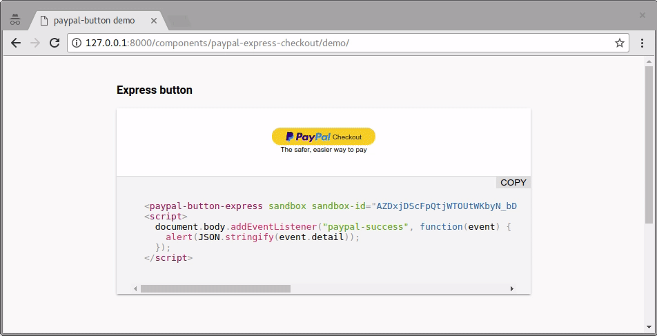

# Polymer 2 wrapper for the Paypal Express Checkout button

[](https://www.webcomponents.org/element/morbidick/paypal-express-checkout)



## Components

### \<paypal-button-express\>

To work around [paypals issue with ShadowDOM](https://github.com/paypal/paypal-checkout/issues/353) this element opens the paypal button in an embedded iframe and communicates via `postMessage`.

<!--
```
<custom-element-demo>
  <template>
    <script src="../webcomponentsjs/webcomponents-lite.js"></script>
    <link rel="import" href="paypal-button-express.html">
    <next-code-block></next-code-block>
  </template>
</custom-element-demo>
```
-->
````html
<paypal-button-express
  sandbox
  sandbox-id="my-id"
  amount="1.00"
  reference="your-payment-reference"
></paypal-button-express>
````

### \<paypal-button-form\>

Using the (older) [paypal form api](https://developer.paypal.com/docs/classic/paypal-payments-standard/integration-guide/formbasics/), a robuster checkout can be accomplished. To get notified about payments you have to set `notify` to an [IPN](https://developer.paypal.com/docs/classic/products/instant-payment-notification/) url on your site.

<!--
```
<custom-element-demo>
  <template>
    <script src="../webcomponentsjs/webcomponents-lite.js"></script>
    <link rel="import" href="paypal-button-form.html">
    <next-code-block></next-code-block>
  </template>
</custom-element-demo>
```
-->
````html
<paypal-button-form
  paypal-id="id@example.org"
  amount="1.00"
  reference="your-payment-reference"
></paypal-button-form>
````

## Polymer build

To build include the paypal.html in your `polymer.json`.

```json
"extraDependencies": [
  "bower_components/paypal-express-checkout/paypal.html"
]
```

## Development

```bash
# Get dependencies
$ npm install

# Demo site
$ npm start

# Run tests
$ npm test
```
